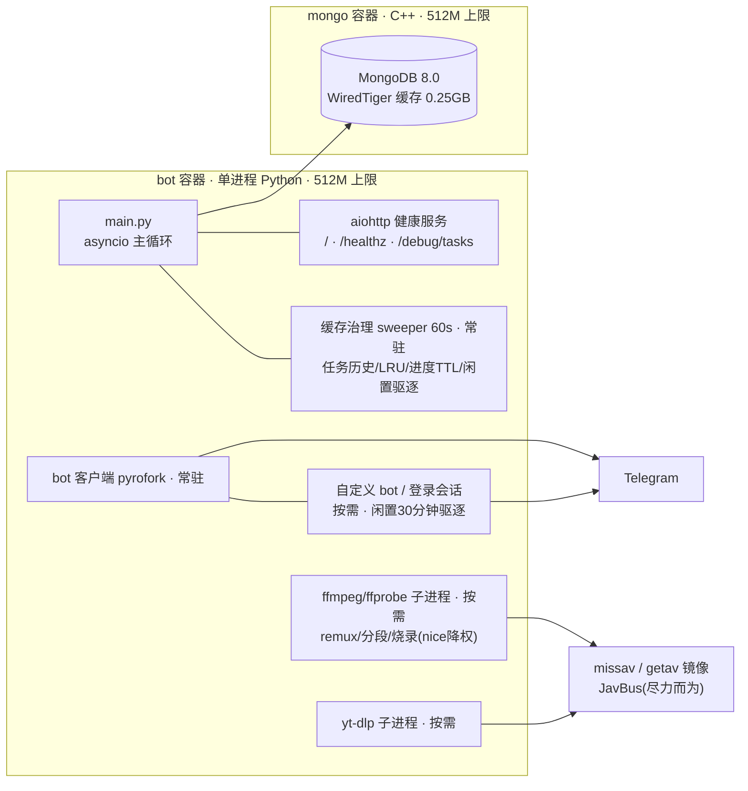

<div align="center">

# Save Restricted Content Bot v3 · 中文优化版

Telegram 私域内容转发与媒体下载机器人 · 番号搜索 / 多版本选择 / 中文字幕烧录

</div>

> 本仓库 Fork 自 [devgaganin/Save-Restricted-Content-Bot-v3](https://github.com/devgaganin/Save-Restricted-Content-Bot-v3)，修复原版 v3 的架构性缺陷（命令注册在已关闭 loop 的 Telethon 上导致 9 个命令永久失效），并在此基础上完成中文本地化与大规模下载管线建设。
> 所有**合规使用**仅限转发/下载自己有权访问的内容；不得用于绕过他人设置的访问限制、抓取受版权保护内容等用途。

---

## ⚡ 能力总览

| 能力 | 入口 | 说明 |
|---|---|---|
| 私域消息转发 | `/single` `/batch` `/merge` | 相册一比一保留（分组/缩略图/说明文字），支持服务端整组复制 |
| 番号搜索 | `/search <番号>` 或直接发番号 | missav 站内搜索 → 封面+badge 交互卡片 → 选片即下 |
| 多版本下载 | `/dl <missav/getav链接>` | 自动探测 原版/中文字幕/无码破解/组合 版本，版本卡片点选或「全部下载」 |
| 中文字幕烧录 | `/dl -sub <链接>` | 站方字幕轨/getav 官方字幕按番号匹配，字幕组风格烧进画面 |
| 通用站点下载 | `/dl` `/adl` | yt-dlp 支持的站点（YouTube/Instagram/Xvideos 等） |
| 任务队列 | `/tasks` `/stop` | 后台串行执行、实时进度、非字幕任务优先、烧录不占并发槽 |

---

## 🚀 快速部署

前置：Docker 24+ 与 Docker Compose v2；在 [@BotFather](https://t.me/BotFather) 创建 Bot 拿到 `BOT_TOKEN`，在 [my.telegram.org](https://my.telegram.org) 拿到 `API_ID` / `API_HASH`。

```bash
git clone <你的fork地址> && cd Save-Restricted-Content-Bot-v3
cp .env.example .env              # 编辑 .env：填入全部 __REQUIRED_*__ 与 __GENERATE_*__ 项
docker compose -p save-restricted-content-bot-v3 up -d --build
docker compose ps                 # bot 与 mongo 均应为 healthy
docker compose exec bot curl -s http://127.0.0.1:5000/healthz   # {"ok": true}
```

给 bot 发送 `/start`，收到欢迎菜单即部署完成。日常运维：`docker compose logs -f --tail=200 bot` 看日志；`docker compose restart` 重启；**回滚**：`git checkout <上一个版本tag> && docker compose up -d --build`。

### AI 可读部署摘要

```yaml
project: save-restricted-content-bot-v3
runtime: {engine: docker, orchestrator: compose_v2, project_name: save-restricted-content-bot-v3}
layout:
  compose_file: docker-compose.yml
  secrets: .env                     # 从 .env.example 复制；绝不提交
  entrypoint: main.py               # 容器内 /app/main.py
  runtime_volume: ../runtime        # session/tmp/downloads；位于仓库外，绝不提交
required_env: [API_ID, API_HASH, BOT_TOKEN, OWNER_ID, LOG_GROUP, MONGO_ROOT_USERNAME,
               MONGO_ROOT_PASSWORD, MONGO_APP_USERNAME, MONGO_APP_PASSWORD,
               DB_NAME, MASTER_KEY, IV_KEY]
optional_env: [STRING, FORCE_SUB, FREEMIUM_LIMIT, PREMIUM_LIMIT, YT_COOKIES,
               INSTA_COOKIES, MISSAV_MIRRORS, GETAV_MIRRORS, BURN_CONCURRENCY,
               BURN_PRESET, BURN_CRF, FFMPEG_BURN_THREADS, BURN_TIMEOUT_S,
               DISK_FREE_MIN_GB, LOG_LEVEL]
steps:
  - "cp .env.example .env 并填满 required_env（__GENERATE_*__ 用 openssl rand -hex 32）"
  - "docker compose -p save-restricted-content-bot-v3 up -d --build"
  - "等待 mongo healthy 且 bot healthy 且 GET :5000/healthz 返回 {\"ok\": true}"
  - "冒烟：向 bot 发送 /start，应收到欢迎菜单"
verify:
  health: "GET :5000/healthz -> {\"ok\": true}"
  diagnostics: "GET :5000/debug/tasks  # asyncio 任务栈，bot 无响应时排查用"
  logs: "docker compose logs --tail=200 bot"
limits: {bot_memory: 512M, mongo_memory: 512M, mongo_wiredtiger_cache: 0.25GB}
rollback: "git checkout <prev_tag> && docker compose up -d --build"
forbidden:
  - "docker compose down -v        # 会删除 mongo 数据卷"
  - "提交 .env / *.session / runtime/  # 含真实凭据"
  - "将 main.py 启动改为 asyncio.run()  # 与 pyrofork Dispatcher 的导入期 loop 绑定冲突，bot 会静默失聪（见 main.py 注释）"
```

完整环境变量表（33 项必填/可选 + 默认值 + 用途）见 [DEPLOYMENT.md](DEPLOYMENT.md)。

---

## 🎬 媒体下载管线

### 站点路由

`/dl` 按链接自动路由：**getav.net**（JSON API）→ **missav 系镜像**（页面解析）→ **yt-dlp 通用站点**。`/adl` 提取音频。

### 番号搜索与多版本选择

- **`/search <番号>`**（或直接发 `SSIS-405` 这类番号文本）：missav 站内搜索，结果以**封面 + 内联按钮卡片**呈现（每条带 `中文字幕`/`无码破解` badge，每页 6 条可翻页，≤10 条）；**唯一命中也出卡片**确认，防错下
- **版本卡片**：选片（或直接 `/dl` 任意 missav 链接）后自动探测同一部片的全部姊妹版本——`原版` / `中文字幕`（`-chinese-subtitle`） / `无码破解`（`-uncensored-leak`） / `无码破解·中文字幕`（组合页）——探测方式为同 host 单次轻量 GET，404/被 Cloudflare 拦截的候选静默跳过
- 卡片 ⭐ 推荐序：组合页 > 中文字幕 > 无码破解 > 原版；**「⏬ 全部下载」**：组合页存在只下组合页，否则中字+无码各入队一个任务
- getav 链接的多版本卡片逻辑同源（中文字幕版/无码版/原版 × 分辨率，按源固定）
- 卡片 10 分钟有效，`/stop` 一键取消全部未决卡片

### 中文字幕烧录（`-sub`）

`/dl -sub <getav或missav链接>`（`-sub` 可在链接前后）。字幕来源按优先级：

1. **missav HLS 字幕轨**：中字版页面的 master playlist 内 `EXT-X-MEDIA TYPE=SUBTITLES` 轨，分段 VTT 下载合并（处理 `X-TIMESTAMP-MAP` MPEGTS 时间偏移 + 跨段重复 cue 去重），与视频天然同时间轴
2. **getav 官方字幕兜底**：页面无字幕轨时，按番号查 getav 影片 API，**id/标题番号边界强匹配**才取其精校中文字幕（防止 `ABC-12` 误配 `ABC-123`）
3. 任一来源失败静默降级为无字幕快速封装，绝不影响视频交付

烧录为字幕组风格硬字幕（白色粗体 + 黑描边 + 柔和阴影，底部居中；**字号按画面高度等比缩放**——恒为高度约 4.5%，分辨率无关）。编码默认 `libx264 superfast / CRF 19 / 源分辨率`：3 核实测 40 分钟片约 13–27 分钟（画质感知无损档，`BURN_PRESET`/`BURN_CRF` 可调，`ultrafast` 可选但暗场渐变有 banding 风险）；音频流 copy 不重编码；烧录期间 ffmpeg 以 `nice 19 + ionice idle` 降权运行，不挤占下载/上传；`cn` 版本自带烧录字幕的不二次烧录。

**资源语义**：烧录类任务（`-sub`）走慢车道——下载完成即释放 `MISSAV_MAX_JOBS` 并发槽（烧录在独立 `BURN_CONCURRENCY` 信号量排队），期间新任务（尤其非字幕任务）正常入场；worker 出队时**非字幕任务优先**。不带 `-sub` 一律秒级无损 remux。

### 投递与文案

- 投递路由：用户设置频道（`/setbot` 机器人发送）→ `LOG_GROUP` → 私聊回退；进度只发私聊
- 成品以**一条相册**投递：封面 + 可直接播放的视频；>1.8GB 自动按关键帧无损分段（`-c copy`，每段独立 moov 可拖进度，最多 9 段）
- caption 五段式：`番号 / 简介 / 演员# / 标签# / 类别#` + 可选 `片商：#片商 #发行日期`；版本 badge（中文字幕/无码破解等）从 slug 自动推导
- **元数据增强**（尽力而为，失败静默）：JavBus 补全片商/发行日期/类型（标签截前 6 个主要标签）；演员名保留 **中文名 (日文名)** 双语（JavBus 优先，missav `/cn/` 页兜底）；进程内 LRU 缓存避免重复请求

### 网络与资源防护

- 镜像轮换过 Cloudflare（curl-cffi Chrome TLS 指纹）；全部请求 pin 到镜像/CDN 注册域，**重定向后的最终 host 复验**，私网/云元数据地址拒绝
- 分段 502/503/504 深重试预算（8 次指数退避封顶 60s）、429 六次、其余快速失败；播放列表/密钥/JSON 4 次退避重试
- 单任务守卫：20k 段 / 20GB 累计 / 8 小时时长 / 封装前磁盘复查（`DISK_FREE_MIN_GB` 水位）；跨用户并发由 `MISSAV_MAX_JOBS` 限制
- IPv6 出口：compose 的 egress 网络启用 `enable_ipv6`——VPS IPv4 被逐连接限速而 IPv6 正常时自动走 IPv6 拉流

---

## 🤖 可用命令

### 📥 内容下载
| 命令 | 说明 |
|---|---|
| `/dl [-sub] <链接>` | 下载视频：missav 系 / getav.net 走内置 HLS 管线（含版本卡片），其余走 yt-dlp；`-sub` 烧录中文字幕 |
| `/search <番号>` | 番号搜索 missav，封面卡片选择下载（直接发番号文本同样生效） |
| `/adl <链接>` | 提取音频 |
| `/tasks` | 任务队列实时进度（每 5 秒刷新，显示百分比/烧录/上传阶段） |
| `/stop` | 取消排队任务与未决卡片（进行中的下载在当前步骤收尾） |

### 🔑 账号与登录
| 命令 | 说明 |
|---|---|
| `/login` / `/logout` | 登录以访问受限内容（支持混淆验证码格式） |
| `/setbot` / `/rembot` | 添加/移除自定义处理机器人 |

### 📥 私域转发
| 命令 | 说明 |
|---|---|
| `/batch` | 批量提取：起始链接+数量，或多行链接逐条下载 |
| `/single` | 单条提取（相册一比一转发） |
| `/merge` | 多条合并为一条消息/相册（>10 项自动拆分） |
| `/cancel` | 取消进行中的登录/批量/设置流程 |

### ⚙️ 设置与会员
| 命令 | 说明 |
|---|---|
| `/settings` | 重命名标签 / 标题 / 缩略图 / 会话 / 删除词 / 替换词 |
| `/status` `/myplan` `/plan` `/pay` `/transfer` | 会员状态与方案（支付统一为联系管理员提示） |
| `/start` `/help` `/terms` | 启动 / 帮助 / 条款 |
| `/add <ID> <时长> <单位>` / `/rem <ID>` / `/set` | 仅管理员 |

---

## 🏗️ 架构



- **常驻**：bot 客户端（pyrofork，唯一接收更新）、aiohttp 健康服务、60s 缓存治理 sweeper、pymongo 连接池
- **按需**：自定义 bot/登录会话客户端（闲置 30 分钟驱逐）、yt-dlp/ffmpeg/ffprobe 子进程
- **下载队列**：每用户独立 worker 串行；missav/getav 任务受跨用户 `MISSAV_MAX_JOBS` 信号量约束，烧录阶段释放该槽并改由 `BURN_CONCURRENCY` 约束；worker 出队非字幕任务优先
- **测试**：`tests/` 553 项 pytest 全离线（`_http_get` monkeypatch + 手造 HTML/m3u8/VTT fixture，含真 ffmpeg 烧录冒烟），运行 `cd src && python3 -m pytest tests/ -q`

---

## 📁 项目结构

```
├── main.py              # 启动入口：共享客户端 + 插件加载 + 进程内健康服务
├── shared_client.py     # Pyrogram（主 Bot + 可选用户账号）客户端
├── config.py            # 全部环境变量读取；BURN_PRESET/BURN_CRF 等烧录档位
├── docker-compose.yml   # 一体化部署（mongo + mongo-init + bot）
├── docker/              # 容器入口与运行时清理脚本
├── plugins/
│   ├── start.py         # /start /help /plan /terms /set 菜单
│   ├── login.py         # 用户登录、会话保存、自定义 Bot 管理
│   ├── batch.py         # /batch /single /merge /cancel /tasks 命令层 + 番号文本路由
│   ├── fetch.py         # 用户 client 缓存、消息获取、peer/linked-chat 缓存
│   ├── ytdl.py          # /dl /adl /search + 番号/版本卡片 + HLS 管线入口与队列编排
│   ├── tasks.py         # 任务队列（非字幕优先）+ 后台 sweeper
│   ├── deliver.py       # 媒体下载、相册/合并投递、FloodWait 重试
│   ├── settings.py premium.py pay.py stats.py
├── utils/
│   ├── missav.py        # missav/getav HLS 管线：镜像轮换/版本探测/字幕轨/烧录
│   ├── javbus.py        # JavBus 元数据补全（尽力而为，LRU 缓存，失败静默）
│   ├── func.py encrypt.py health.py caption.py custom_filters.py logging_setup.py ratelimit.py
├── tests/               # 553 项 pytest 离线回归
└── templates/welcome.html
```

---

## 🔧 Fork 相对原版的核心修复（历史）

<details>
<summary><b>架构性缺陷与命令修复</b></summary>

| 修复项 | 原版问题 | 本 Fork 处理 |
|---|---|---|
| **命令失效（核心）** | 9 个处理器注册在被关闭 loop 的 Telethon 上，全部无反应 | 全部迁移到 Pyrogram 客户端 |
| **`/myplan` 幽灵命令** | help 宣传但无实现 | 新增实现 |
| **`pay.py` 崩溃** | 未导入 `OWNER_ID`、缺 chat_id | 重写为统一提示文案 |
| **菜单与实际不符** | 注册瘫痪命令、help 列不存在命令 | 菜单与 help 对齐真实命令 |
| **`ytdl` cookie/大文件阈值错误** | cookie 传字面量；2MiB 误写为 2GB | 已修正 |
| **`/single` 相册与 MEDIA_EMPTY 系列** | 相册只下一项、file_id 跨客户端失效、>2GB 丢视频 | 服务端整组复制优先 + 抓取客户端正确选型 + 下载重传回退（详见 git 历史） |
| **`/setbot` 令牌识别** | 保存/读取清洗不一致 | 统一校验 |
| **pyrofork 相册双发** | 2.3.69 `send_media_group` 漏 `topics` 参数 | 导入期 monkeypatch 兜底 |
| **进度消息刷频道 / `/login` 验证码失效 / 无 .gitignore** | 各自独立缺陷 | 进度只发私聊；混淆验证码提取；新增 .gitignore |

</details>

<details>
<summary><b>2026-08 重构（安全/磁盘/内存/DB/结构/吞吐）</b></summary>

| 维度 | 改动 |
|---|---|
| **加密加固** | 会话/token AES-GCM（随机 salt），旧格式自动迁移 |
| **磁盘自愈** | 任务产物即用即删 + 多级孤儿清扫 + 上传心跳防误删 |
| **依赖瘦身** | 移除死代码 Telethon 栈与 OpenCV；全依赖锁版本 |
| **内存有界化** | sweeper 统一治理：任务历史/LRU/进度 TTL/闲置客户端驱逐（空闲基线 109→86MiB，cgroup 回收事件 93 万→0） |
| **DB 优化** | 每任务一次设置快照替代逐消息查询；唯一索引与 TTL 索引启动期创建 |
| **消息获取** | per-user peer 缓存（24h TTL，上限 500）跳过全量遍历 |
| **代码拆分** | 2130 行上帝文件拆为 fetch/tasks/deliver + 命令层 batch.py，零功能变更 |
| **吞吐** | 流水线预取 + AIMD 自适应间隔 + 进度时间节流 |
| **稳定性** | 视频宽高实参互换、FREMIUM_LIMIT 拼写、到期日格式化等修复 |

</details>

<details>
<summary><b>2026-09 下载管线 Wave（本轮）</b></summary>

| Issue | 内容 |
|---|---|
| #17 | missav 姊妹版本探测（slug 变体数学 + 存在性探测）与 `mav:` 版本卡片（含「全部下载」） |
| #18 | missav HLS 字幕轨捕获 + 分段 VTT 合并烧录 + getav 官方字幕按番号强匹配兜底 |
| #19 | 烧录 superfast 化（同画质提速 1.5–1.8×）、ffconcat 直读分片消灭 merged.ts（省 4–8GB IO/job）、ffmpeg nice/ionice 降权 |
| #20 | 队列慢车道：烧录挪出 job 槽 + worker 非-sub 优先 |
| #16 | `/search` 番号搜索 + 封面交互卡片 + 纯番号文本路由 |
| #21 | JavBus 元数据补全（主标签 ≤6）+ 演员 CN/JP 双名 |
| #22 | 依赖核对升级（yt-dlp 2026.8.19 / curl-cffi 0.16.3 / cryptography 50.0.1）+ 部署文档 env 全表 |
| #14 | CodeQL：URL 路由 hostname 匹配，script 正则大小写不敏感 |

对抗审查修复（reviewer + security-reviewer 双向）：字幕/getav/javbus 三条抓取路径的**重定向最终 host 复验**、getav 兜底番号边界匹配防误配、加密分段预算 check/reserve 原子化、封装前磁盘二次复查、封面 URL 域白名单（SSRF 加固）、hashtag markdown 字符清洗。

</details>

> ⚠️ 安全提示：老版本部署过的 session 文件与 bot token 应视为已暴露，建议在 Telegram 内终止旧会话并重置 bot token；`IV_KEY` 现仅用于解密旧格式数据，仍需保留原值直至全部旧数据迁移完成。

---

## 📋 环境变量

完整表见 [DEPLOYMENT.md](DEPLOYMENT.md)（36 项：必填/可选/默认值/用途）。高频项速查：

| 变量 | 默认 | 说明 |
|---|---|---|
| `MISSAV_MIRRORS` | 内置列表 | missav 镜像域名，逗号分隔 |
| `GETAV_MIRRORS` | `getav.net` | getav 镜像域名 |
| `MISSAV_SEGMENT_CONCURRENCY` | `8` | 分段下载并发（1–32） |
| `MISSAV_MAX_JOBS` | `2` | 跨用户同时下载任务上限（烧录阶段不占槽） |
| `BURN_CONCURRENCY` | `1` | 烧录并发上限 |
| `BURN_PRESET` | `superfast` | 烧录 x264 preset（同 CRF 下 veryfast 更慢、ultrafast 有 banding 风险） |
| `BURN_CRF` | `19` | 烧录恒定质量因子 |
| `FFMPEG_BURN_THREADS` | `0`（自动 2–8） | 烧录线程数 |
| `BURN_TIMEOUT_S` | `10800` | 单次烧录超时（超时回退无字幕封装） |
| `DISK_FREE_MIN_GB` | `10` | 任务准入与封装前磁盘水位（GB） |
| `PAY_NOTICE` / `ADMIN_CONTACT` | — | 支付提示与联系方式 |

> ⚠️ `MASTER_KEY`/`IV_KEY` 源码默认值仅演示，生产务必用随机值覆盖。

---

## 🛠️ 开发约定

- **测试**：全部离线。网络层以 `_http_get` 为唯一 seam monkeypatch，页面/m3u8/VTT/搜索结果均为手造 fixture；`cd src && python3 -m pytest tests/ -q`
- **分支流**：`main` 为集成分支；功能分支 `feat/*`、修复分支 `fix/*`（issue 编号后缀）；多任务并行开发使用 `git worktree`
- **安全基线**：新网络面必须 pin 注册域并复验重定向最终 host；页面可控内容（标题/演员/标签）进入 caption 前必须清洗；新增回调必须绑定 uid + TTL + sweeper

---

## ⚖️ 免责声明

- 本机器人仅用于转发/下载 **您自己有权访问** 的内容。
- 不对用户行为负责，不推广受版权保护的内容。
- 使用非官方客户端登录的账号可能受到 Telegram 的额外审查，请只使用合法授权的账号。
- 遵守 [Telegram API Terms of Service](https://core.telegram.org/api/terms)。

---

## 🙏 致谢

- 原作者：[devgagan / Team SPY](https://github.com/devgaganin)
- 本 Fork 由 [paceyw](https://github.com/paceyw) 维护：Bug 修复、中文本地化与下载管线建设
