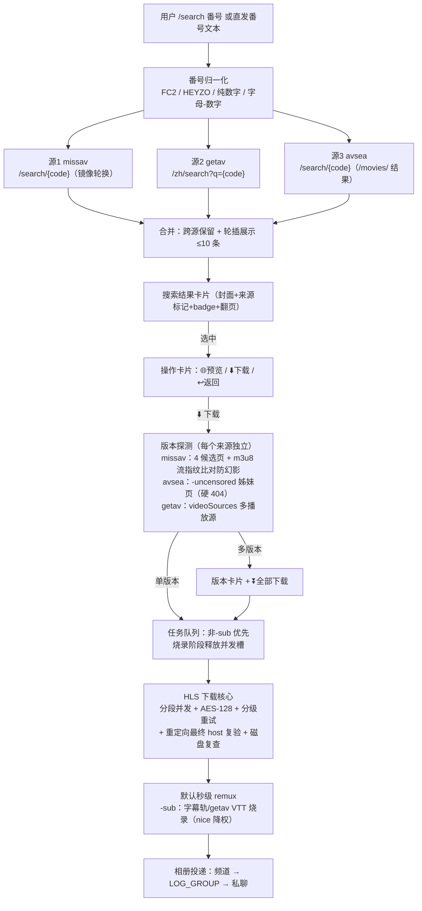
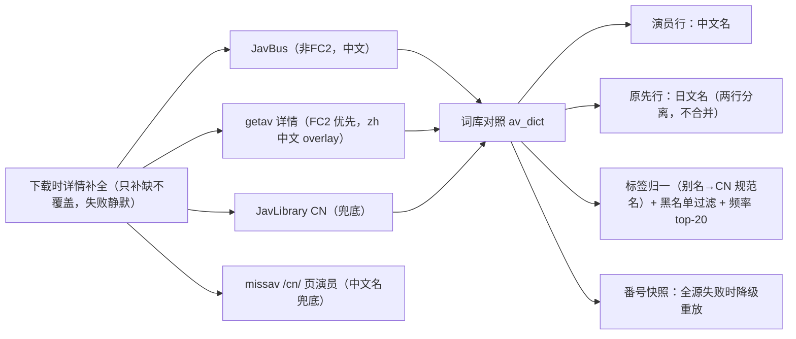

<div align="center">

# Save Restricted Content Bot v3 · 中文优化版

Telegram 私域内容转发与媒体下载机器人 · 番号搜索 / 多版本选择 / 中文字幕烧录

</div>

> 本仓库 Fork 自 [devgaganin/Save-Restricted-Content-Bot-v3](https://github.com/devgaganin/Save-Restricted-Content-Bot-v3)，修复原版 v3 的架构性缺陷（9 个命令注册在已关闭 loop 的 Telethon 上永久失效），并完成中文本地化与下载管线建设。
> 所有**合规使用**仅限转发/下载自己有权访问的内容；不得用于绕过他人设置的访问限制、抓取受版权保护内容等用途。

**目录**：[一、部署指南](#一部署指南) ｜ [二、功能介绍](#二功能介绍命令与使用方法) ｜ [三、原理解析](#三原理解析) ｜ [项目结构](#-项目结构) ｜ [开发约定](#-开发约定) ｜ [免责声明](#-免责声明)

---

# 一、部署指南

## 人工部署（Docker Compose）

前置：Docker 24+ 与 Docker Compose v2；在 [@BotFather](https://t.me/BotFather) 创建 Bot 拿到 `BOT_TOKEN`，在 [my.telegram.org](https://my.telegram.org) 拿到 `API_ID` / `API_HASH`。

```bash
git clone <你的fork地址> && cd Save-Restricted-Content-Bot-v3
cp .env.example .env              # 编辑 .env：填入全部 __REQUIRED_*__ 与 __GENERATE_*__ 项
docker compose -p save-restricted-content-bot-v3 up -d --build
docker compose ps                 # bot 与 mongo 均应为 healthy
docker compose exec bot curl -s http://127.0.0.1:5000/healthz   # {"ok": true}
```

给 bot 发送 `/start`，收到欢迎菜单即部署完成。

### 运维

| 操作 | 命令 |
|------|------|
| 看日志 | `docker compose logs -f --tail=200 bot` |
| 重启 | `docker compose restart` |
| 健康诊断 | `GET :5000/healthz`（存活）；`GET :5000/debug/tasks`（asyncio 任务栈） |
| 回滚 | `git checkout <上一个版本tag> && docker compose up -d --build` |

> ⚠️ 禁止 `docker compose down -v`（会删除 mongo 数据卷）；`.env` 与 `*.session` 含真实凭据，绝不提交。

## AI 可读部署（YAML）

```yaml
project: save-restricted-content-bot-v3
runtime: {engine: docker, orchestrator: compose_v2, project_name: save-restricted-content-bot-v3}
layout:
  compose_file: docker-compose.yml
  secrets: .env                     # 从 .env.example 复制；绝不提交
  entrypoint: main.py               # 容器内 /app/main.py
  runtime_volume: ../runtime        # session/tmp/downloads；位于仓库外，绝不提交
required_env: [API_ID, API_HASH, BOT_TOKEN, OWNER_ID, LOG_GROUP, MONGO_ROOT_USERNAME,
               MONGO_ROOT_PASSWORD, MONGO_APP_USERNAME, MONGO_APP_PASSWORD,
               DB_NAME, MASTER_KEY, IV_KEY]
optional_env: [STRING, FORCE_SUB, FREEMIUM_LIMIT, PREMIUM_LIMIT, YT_COOKIES,
               INSTA_COOKIES, MISSAV_MIRRORS, GETAV_MIRRORS, BURN_CONCURRENCY,
               BURN_PRESET, BURN_CRF, FFMPEG_BURN_THREADS, BURN_TIMEOUT_S,
               DISK_FREE_MIN_GB, LOG_LEVEL]
steps:
  - "cp .env.example .env 并填满 required_env（__GENERATE_*__ 用 openssl rand -hex 32）"
  - "docker compose -p save-restricted-content-bot-v3 up -d --build"
  - "等待 mongo healthy 且 bot healthy 且 GET :5000/healthz 返回 {\"ok\": true}"
  - "冒烟：向 bot 发送 /start，应收到欢迎菜单"
verify:
  health: "GET :5000/healthz -> {\"ok\": true}"
  diagnostics: "GET :5000/debug/tasks"
  logs: "docker compose logs --tail=200 bot"
limits: {bot_memory: 512M, mongo_memory: 512M, mongo_wiredtiger_cache: 0.25GB}
rollback: "git checkout <prev_tag> && docker compose up -d --build"
forbidden:
  - "docker compose down -v        # 会删除 mongo 数据卷"
  - "提交 .env / *.session / runtime/  # 含真实凭据"
  - "将 main.py 启动改为 asyncio.run()  # 与 pyrofork Dispatcher 的导入期 loop 绑定冲突，bot 会静默失聪"
```

## 环境变量

完整表（36 项：必填/可选/默认值/用途）见 [DEPLOYMENT.md](DEPLOYMENT.md)。速查：

| 变量 | 默认 | 说明 |
|------|------|------|
| `API_ID` / `API_HASH` / `BOT_TOKEN` | — | Telegram 凭据（必填） |
| `OWNER_ID` | — | 管理员用户 ID，空格分隔（必填） |
| `MONGO_DB` / `DB_NAME` | — | MongoDB 连接与库名（必填） |
| `MASTER_KEY` / `IV_KEY` | — | 会话加密密钥，**生产必须随机覆盖**（必填） |
| `LOG_GROUP` | `0` | 默认投递频道；`0` 不启用 |
| `FORCE_SUB` | `0` | 强制订阅频道 ID |
| `STRING` | 空 | 高级账号会话串（>2GB 上传需要） |
| `MISSAV_MIRRORS` | 内置 5 站 | missav 镜像，逗号分隔（含 avsea.site） |
| `GETAV_MIRRORS` | `getav.net` | getav 镜像 |
| `MISSAV_SEGMENT_CONCURRENCY` | `8` | 分段下载并发（1–32） |
| `MISSAV_MAX_JOBS` | `2` | 跨用户同时下载任务上限（烧录阶段不占槽） |
| `BURN_CONCURRENCY` | `1` | 字幕烧录并发上限 |
| `BURN_PRESET` / `BURN_CRF` | `superfast` / `19` | 烧录编码档位 |
| `FFMPEG_BURN_THREADS` / `BURN_TIMEOUT_S` | `0`（自动）/ `10800` | 烧录线程与超时 |
| `DISK_FREE_MIN_GB` | `10` | 任务准入与封装前磁盘水位（GB） |
| `FREEMIUM_LIMIT` / `PREMIUM_LIMIT` | `0` / `500` | 免费/会员批量条数上限 |
| `PAY_NOTICE` / `ADMIN_CONTACT` | — | 支付提示与联系方式 |

---

# 二、功能介绍（命令与使用方法）

## 命令总览

| 分类 | 命令 |
|------|------|
| 私域转发 | `/batch` `/single` `/merge` `/tasks` `/stop` `/cancel` |
| 番号搜索下载 | `/search` `/dl` `/adl` |
| 账号 | `/login` `/logout` `/setbot` `/rembot` |
| 设置 | `/settings` |
| 会员 | `/status` `/myplan` `/plan` `/pay` `/transfer` |
| 其他 | `/start` `/help` `/terms` |
| 管理员 | `/add` `/rem` `/set` |

## 私域转发：/batch、/single、/merge

三个命令均为**两步交互**，且支持**自定义说明**（替换原说明文字）：

```
第一步：/命令 [自定义说明]      ← 命令后缀的整段文字会替换转发内容的原说明
第二步：发送链接                ← 按命令要求发一条或多条链接
```

### /single — 单条提取

```
/single                        ← 可不带说明
然后发送一条消息链接
```

- 相册消息**一比一转发**：保留分组、顺序、原缩略图与说明文字
- 优先服务端整组复制（不受 bot 上传上限约束）；受限内容自动下载重传
- 带自定义说明时替换原说明；无说明时原说明若含结构化元素（番号/标签行/≥2 个 #hashtag）自动重排为固定五行骨架便于补全：

  ```
  GVH-690

  【无码破解】巨乳女教师的课后辅导 中文字幕

  演员：#夕美しおん
  标签：#巨乳 #女教师
  类别：
  ```

### /batch — 批量提取（需登录）

两种模式（第二步发链接时自动识别）：

```
/batch                         ← 第一步
https://t.me/xxx/201           ← 模式一：一条起始链接
5                              ← 再输入数量：从该消息起连续提取 5 条
```

```
/batch                         ← 第一步
https://t.me/xxx/201           ← 模式二：每行一条，贴多条不连续链接
https://t.me/xxx/315
https://t.me/xxx/520
```

- 条数上限：免费 `FREEMIUM_LIMIT` / 会员 `PREMIUM_LIMIT`
- 命令后缀文字作为每条的自定义说明
- 流水线执行（下一条抓取与上一条上传重叠），FloodWait 自适应退避

### /merge — 合并提取

```
/merge 合并后的说明文字         ← 第一步（说明可省略，省略则保留各自原说明）
https://t.me/xxx/1             ← 第二步：每行一条
https://t.me/xxx/2
```

- 多条合并为**一条消息/相册**发送；超过 10 项自动拆分并附 `(1/N)` 标记

### /settings — 个性化设置（影响转发与投递）

| 设置项 | 作用 |
|--------|------|
| 重命名标签 | 转发文件的文件名前缀 |
| 标题 | 自定义标题 |
| 删除词语 | 从说明文字中删除这些词 |
| 替换词语 | 说明文字中的词替换为新词 |
| 缩略图 | 自定义视频缩略图 |
| 会话 | 用户会话管理 |
| 词库管理 | 查看影片信息词库（按使用频率排序）；点击词条拉黑/恢复，拉黑后该词不再进入影片信息 |

### /tasks 与 /stop

- `/tasks`：实时队列视图（每 5 秒刷新，显示下载百分比/烧录/上传阶段）
- `/stop`：取消排队任务与未决卡片；进行中的下载在当前步骤收尾

## 番号搜索与下载：/search、/dl、/adl

### /search — 番号搜索

```
/search SSIS-405               ← 或直接发送番号文本（SSIS-405 / fc2ppv 123 均可识别）
```

- **三源搜索**：missav + getav + avsea 轮插合并（结果带 `[M]/[G]/[A]` 来源标记与 中文字幕/无码破解 badge，≤10 条，卡片标题显示各源条数）
- 卡片：首条封面 + 每行一结果，翻页浏览；**唯一命中也出卡片**确认
- 选中结果后弹出**操作卡片**：

| 按钮 | 行为 |
|------|------|
| 🌐 预览网页 | 浏览器直接打开原页面 |
| 🔥 外挂字幕 | 手动开/关（= `/dl -sub` 语义：missav HLS 字幕轨 / getav 官方 VTT 烧录；avsea 无字幕源不生效），状态在本轮搜索内保留 |
| ⬇️ 下载 | 检测到外挂字幕（getav 官方中字 / missav HLS 字幕轨）且未手动表态时，先询问「烧录 / 不烧录 / 返回」；随后探测版本 → 版本卡片或直接入队（携带字幕状态） |
| ↩️ 返回搜索结果 | 恢复结果卡片重选（分页状态保留） |

- 卡片 10 分钟有效，`/stop` 取消

### /dl — 下载视频（含版本选择与字幕烧录）

```
/dl <链接>                     ← 任意支持站点
/dl -sub <链接>                ← 烧录中文字幕（getav/missav）
```

- **版本探测**：missav 链接自动探测 原版 / 中文字幕 / 无码破解 / 无码破解·中文字幕（组合）姊妹页（流指纹比对防幻影误判）；avsea 探测 原版 / `-uncensored` 无码页；getav 按 videoSources 分版本
- **版本卡片**：多版本时弹出（⭐推荐：组合>中字>无码>原版 + **⏬ 全部下载**），单版本直接入队
- **三源下载管线**：missav 系（含 avsea 镜像）/ getav JSON API 走内置 HLS 管线（分段并发 + AES-128 解密 + 分级重试），其余站点走 yt-dlp
- **字幕烧录**（`-sub`）：字幕优先级 missav HLS 字幕轨 > getav 官方 VTT（番号强匹配）；字幕组风格烧进画面，字号随分辨率等比；不带 `-sub` 秒级无损封装
- 成品以相册投递（封面 + 视频，>1.8GB 自动关键帧无损分段）；caption 骨架：番号/简介/演员（中文名）/原名（日文名）/标签/类别（=版本 badge + 词库派生类别；缺数据留空占位）
- **词库对照**：演员行 = 中文名 + 日文名同行（同名去重）；标签行 = 内容标签（别名自动归一如 中出し→中出、按全局使用频率取 top-20、黑名单过滤）；类别行 = 有无码/字幕等版本标识（同样过黑名单）；未收录的词自动学习沉淀

### /adl — 提取音频

## 投递规则

所有站点成品统一投递：**用户设置频道（`/setbot` 机器人发送）→ `LOG_GROUP` → 私聊回退**；下载/上传进度只发私聊与 `/tasks`。

## 会员与管理

- `/status` `/myplan`：登录与会员状态；`/plan` `/pay`：统一提示联系管理员（文案由 `PAY_NOTICE`/`ADMIN_CONTACT` 配置）
- `/transfer`：会员转赠（仅高级会员）
- `/add <ID> <时长> <单位>`、`/rem <ID>`、`/set`：仅管理员

---

# 三、原理解析

## 总体架构



### 信息（元数据）补全链与词库对照



## 下载核心与队列语义

- **通用 HLS 核心**：missav / getav / avsea 三站共用同一下载核心——页面解析取 m3u8 → 主清单变体选择 → 分段并发下载（AES-128 解密）→ ffconcat 直读分片封装（无 merged.ts 中间拷贝）。资源守卫：20k 段 / 20GB / 8 小时 / 磁盘水位双检查 / 重定向最终 host 复验
- **镜像轮换**：发送 host 优先 → 其余镜像（missav 5 站含 avsea）；403/CF 拦截自动切换；502/503/504 深重试预算（8 次指数退避）
- **404 分级自愈**：① 瞬态 404 同 URL 短退避（2/4/8s）；② **Cloudflare 边缘粘性 404**（源站瞬时 404 被 CF 按 max-age=1y 缓存，该 URL 永久 404，ADN-538 三连案实锤 cf-cache-status: HIT/age 天级/空体）→ 加唯一 `_cfbust` 随机参数穿透缓存键直回源站（实测 cf=MISS 200）；③ 仍 404 才刷新媒体清单（间隔退避 30/60/90s）只补缺失分片（AES 密钥/序列轮换时废弃旧解密分片全量重下）
- **队列慢车道**：烧录类任务下载完成即释放 `MISSAV_MAX_JOBS` 槽，烧录由 `BURN_CONCURRENCY` 独立约束；worker 出队非-sub 优先——快任务永不排队等慢任务
- **烧录**：`superfast/CRF19/源分辨率`，ffmpeg `nice 19 + ionice idle` 降权；字幕来源优先级 missav HLS 字幕轨 > getav 官方 VTT（番号边界强匹配）；中字版自带烧录字幕的不二次烧录
- **幻影版本防护**：missav 对未知 slug 后缀会返回基础视频的可播放页（幻影别名）；版本探测以 **m3u8 流指纹（per-video UUID）必须不同于基础页**为准，指纹相同一律剔除

## 本 Fork 相较原版的升级与独创

### 架构性修复（原版缺陷）

| 修复项 | 原版问题 | 本 Fork 处理 |
|---|---|---|
| **命令失效（核心）** | 9 个处理器注册在被关闭 loop 的 Telethon 上，全部无反应 | 全部迁移到 Pyrogram 客户端 |
| `/myplan` 幽灵命令、`pay.py` 必崩、菜单与实际不符 | 各自独立缺陷 | 全部修复并对齐 |
| `ytdl` cookie 传字面量、大文件阈值 2MiB 误为 2GB | 参数错误 | 已修正 |
| `/single` 相册系列缺陷 | 只取单项、file_id 跨客户端 MEDIA_EMPTY、>2GB 丢视频 | 服务端整组复制优先 + 客户端正确选型 + 下载回退 |
| pyrofork 2.3.69 相册双发 | `send_media_group` 漏 `topics` 参数 | 导入期 monkeypatch 兜底 |
| 进度刷频道、登录验证码失效、无 .gitignore | — | 进度只发私聊；混淆验证码提取；补 .gitignore |

### 独创功能（原版没有）

| 功能 | 说明 |
|------|------|
| **番号搜索三源卡片** | missav/getav/avsea 轮插合并、来源标记、封面卡片、翻页、操作卡片（预览/下载/返回） |
| **missav/getav/avsea 下载管线** | packed-JS/JSON-API/Nuxt-UrlHls 三种嗅探、流指纹版本探测防幻影、AES-128 分段并发、镜像轮换 |
| **中文字幕烧录** | missav HLS 字幕轨 / getav 官方 VTT 番号强匹配兜底 → 字幕组风格烧录（分段 VTT 合并含 X-TIMESTAMP-MAP 偏移） |
| **队列慢车道** | 烧录不占下载并发槽、非-sub 任务优先、烧录进程 nice/ionice 降权 |
| **任务队列** | 每用户 worker、实时进度、/stop 取消；原版同步阻塞 |
| **相册保真转发** | 整组复制、无音轨静音轨重封装、坏项跳过重试、>2GB 关键帧无损分段 |
| **元数据骨架文案 + av 词库** | 番号/简介/演员（中日名同行）/标签/类别 五段式；JavBus/JavLibrary/getav 多源补全 + 本地词库对照（演员中日名互查、标签别名归一去重、黑名单负面清单、频率 top-20、番号快照降级重放、设置页词库管理） |

### 2026-08 重构与 2026-09 Wave（折叠）

<details>
<summary><b>2026-08 重构（安全/磁盘/内存/DB/结构/吞吐）</b></summary>

| 维度 | 改动 |
|---|---|
| **加密加固** | 会话/token AES-GCM（随机 salt），旧格式自动迁移 |
| **磁盘自愈** | 任务产物即用即删 + 多级孤儿清扫 + 上传心跳防误删 |
| **依赖瘦身** | 移除死代码 Telethon 栈与 OpenCV；全依赖锁版本 |
| **内存有界化** | sweeper 统一治理（空闲基线 109→86MiB，cgroup 回收事件 93 万→0） |
| **DB 优化** | 每任务一次设置快照替代逐消息查询；索引启动期创建 |
| **消息获取** | per-user peer 缓存（24h TTL，上限 500） |
| **代码拆分** | 2130 行上帝文件拆为 fetch/tasks/deliver + 命令层 |
| **吞吐** | 流水线预取 + AIMD 自适应间隔 + 进度时间节流 |

</details>

<details>
<summary><b>2026-09 下载管线 Wave</b></summary>

| Issue | 内容 |
|---|---|
| #17/#18 | missav 姊妹版本探测（流指纹防幻影）+ 版本卡片 + HLS 字幕轨烧录 + getav 官方字幕兜底 |
| #19 | 烧录 superfast 化 + ffconcat 消 merged.ts + ffmpeg nice/ionice 降权 |
| #20 | 队列慢车道（烧录挪出 job 槽 + 非-sub 优先） |
| #16 | /search 三源搜索 + 封面操作卡片 + 纯番号文本路由 |
| #21 | JavBus/JavLibrary 元数据补全 + 演员 CN/JP 双名 |
| #14/#22 | CodeQL 路由修复 + 依赖升级 + 部署文档 env 全表 |
| 后续 | avsea.site 下载管线（Nuxt UrlHls 提取）+ 搜索三源轮插 + 幻影流指纹修复 + 骨架留空 caption |

对抗审查（correctness + security 双向）：重定向最终 host 复验、番号边界匹配防误配、分段预算原子化、封面域白名单（SSRF）、hashtag markdown 清洗——全部带回归测试。

</details>

### av 词库（av_dict）：对照、学习与降级

三层轻量词库（mongo 同库集合，随下载**渐进沉淀，无需预置**）：

| 集合 | 内容 | 用途 |
|---|---|---|
| `av_actress` | 日文名 → 中文名对照（aliases 变体、hits、sources） | 演员 CN/JP 互查：javbus/getav 配对成功即学习；之后查库直取 |
| `av_tag` | 标签规范名（aliases、hits 频率、blacklisted） | 相似标签归并去重（中出し→中出同条计数）、黑名单、每片标签按频率取 top-20 |
| `av_code` | 番号 → 元数据快照（v2 字段白名单，30 天有效） | 在线源**全失败**时降级重放；部分补齐只合并不覆盖 |

- **种子数据**（`avdict_seed.py`）：117 条别名表（JP/繁体/写法变体 → CN 规范名），运行时以库为准；所有获取到的标签自动入库计数（学习回路）
- **矫正语义**：中文名仅空时填充（`$setOnInsert` 原子占位，无竞态覆盖）；序位学习仅在两侧数量一致时进行（防跨站排序错位污染）；已知对照零写放大
- **黑名单（负面清单）**：`/settings` → 📚 词库管理，按频率浏览词条、点击拉黑/恢复；拉黑词不再进入影片信息（标签与类别行同源过滤），历史频率保留、恢复后重回排序
- **标签限额**：每影片标签行最多 20 个（不含演员与类别），按全局频率从高到低截取，超出舍弃
- **故障隔离**：同步 pymongo 跑在下载线程内，连接类故障触发 **60s 熔断**（词库整体静默降级，不影响下载）；键长上限 100、快照键格式守卫（防页面垃圾串制造键碎片）
- **演员行合并**：中文名 + 日文名同行渲染（同名去重），兼容解析旧「中文名 (日文名)」合并格式

---

# 📁 项目结构

```
├── main.py              # 启动入口：共享客户端 + 插件加载 + 进程内健康服务
├── shared_client.py     # Pyrogram（主 Bot + 可选用户账号）客户端
├── config.py            # 全部环境变量读取；BURN_PRESET/BURN_CRF 等烧录档位
├── docker-compose.yml   # 一体化部署（mongo + mongo-init + bot）
├── docker/              # 容器入口与运行时清理脚本
├── plugins/
│   ├── start.py         # /start /help /plan /terms /set 菜单（启动即刷新命令菜单）
│   ├── login.py         # 用户登录、会话保存、自定义 Bot 管理
│   ├── batch.py         # /batch /single /merge /cancel /tasks 命令层 + 番号文本路由
│   ├── fetch.py         # 用户 client 缓存、消息获取、peer/linked-chat 缓存
│   ├── ytdl.py          # /dl /adl /search + 三源搜索/版本卡片/操作卡片 + 队列编排
│   ├── tasks.py         # 任务队列（非-sub 优先）+ 后台 sweeper
│   ├── deliver.py       # 媒体下载、相册/合并投递、FloodWait 重试
│   ├── settings.py premium.py pay.py stats.py
├── utils/
│   ├── missav.py        # missav/getav HLS 管线：镜像轮换/版本探测/字幕轨/烧录
│   ├── avsea.py         # avsea.site 管线：Nuxt UrlHls 线路提取/下载
│   ├── avdict.py        # av 词库：演员对照/标签归一/黑名单/频率 top-20/番号快照（熔断降级）
│   ├── avdict_seed.py   # 词库种子：117 条标签别名表（运行时以库为准）
│   ├── javbus.py        # JavBus/JavLibrary 元数据补全（尽力而为，LRU）
│   ├── func.py encrypt.py health.py caption.py custom_filters.py logging_setup.py ratelimit.py
├── tests/               # 642 项 pytest 离线回归
└── templates/welcome.html
```

# 🛠️ 开发约定

- **测试**：全部离线。网络层以 `_http_get` 为唯一 seam monkeypatch，页面/m3u8/VTT/搜索结果均为手造 fixture；`cd src && python3 -m pytest tests/ -q`
- **分支流**：`main` 为集成分支；功能分支 `feat/*`、修复分支 `fix/*`（issue 编号后缀）；多任务并行开发使用 `git worktree`
- **安全基线**：新网络面必须 pin 注册域并复验重定向最终 host；页面可控内容进入 caption 前必须清洗；新增回调必须绑定 uid + TTL + sweeper

# ⚖️ 免责声明

- 本机器人仅用于转发/下载 **您自己有权访问** 的内容。
- 不对用户行为负责，不推广受版权保护的内容。
- 使用非官方客户端登录的账号可能受到 Telegram 的额外审查，请只使用合法授权的账号。
- 遵守 [Telegram API Terms of Service](https://core.telegram.org/api/terms)。

# 🙏 致谢

- 原作者：[devgagan / Team SPY](https://github.com/devgaganin)
- 本 Fork 由 [paceyw](https://github.com/paceyw) 维护：Bug 修复、中文本地化与下载管线建设
